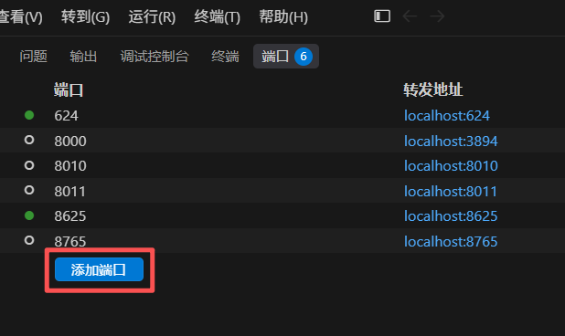
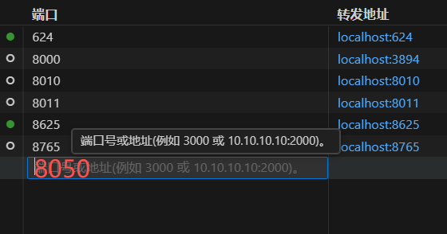

# 实验室 GPU 实时状态监控

一个简单的分布式 GPU 监控系统，用于实时查看实验室 GPU 的占用情况及当前使用者，帮助避免任务冲突。

## 如何访问
### 方法一
将实验室四卡的8050端口映射到本机：
```bash
ssh -L 8050:localhost:8050 lx@49.52.27.92 -p 22
```
保持该终端窗口不要关闭：SSH 隧道是随着连接存在的，一旦你关掉这个终端，隧道就断了。

使用本机浏览器打开：

```text
http://localhost:8050
```
### 方法二

直接使用 Visual Studio Code 或 Cursor 连接四卡服务器，在 SSH 配置中添加端口转发,将远程服务器的 8050 端口映射到本地




保持vscode/cursor不要关闭：SSH 隧道是随着连接存在的，一旦你关掉这个窗口，隧道就断了。

配置完成后，在本地浏览器访问：
```text
http://localhost:8050
```

## 部署步骤

### 1. 在GPU 服务器上启动 Agent （在每个服务器上都要跑）

1. 将 `agent/` 文件夹内容拷贝到服务器。
2. 安装依赖：

```bash
conda create -n gpu-monitor python=3.10 -y
conda activate gpu-monitor
pip install -r requirements.txt
```

3. 启动 Agent：

```bash
cd agent
bash run_agent.sh
```

> 注意：Agent 默认运行在容器内的 `8000` 端口。

### 2. 建立 SSH 隧道（只在主控机上跑）

由于服务器通过不同端口转发，Dashboard 所在机器需要建立 SSH 隧道才能获取数据。  
请在运行 Dashboard 的机器上打开两个终端窗口：

Example：

- `shared0`：

```bash
ssh -L 8001:localhost:8000 -i "你的key.pem" root@172.23.166.144 -p 35687
```

- `share1`：

```bash
ssh -L 8002:localhost:8000 -i "你的key.pem" root@172.23.166.144 -p 30852
```

> 提示：保持这两个 SSH 窗口常驻，或使用 `screen` / `tmux` 后台运行。

### 3. 启动 Dashboard 展示端 （只在主控机上跑）

修改 `dashboard/app.py` 中的 `MONITOR_NODES`，确认映射关系：

Example：

```python
MONITOR_NODES = [
    {"name": "shared0", "url": "http://localhost:8001/metrics"},
    {"name": "share1", "url": "http://localhost:8002/metrics"}
]
```

然后运行：

```bash
cd dashboard
bash run_dash.sh
```

