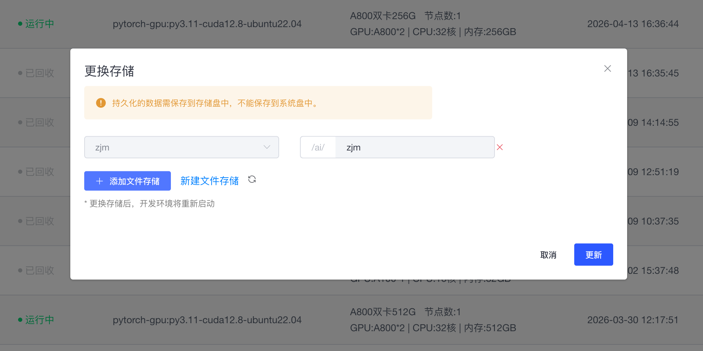
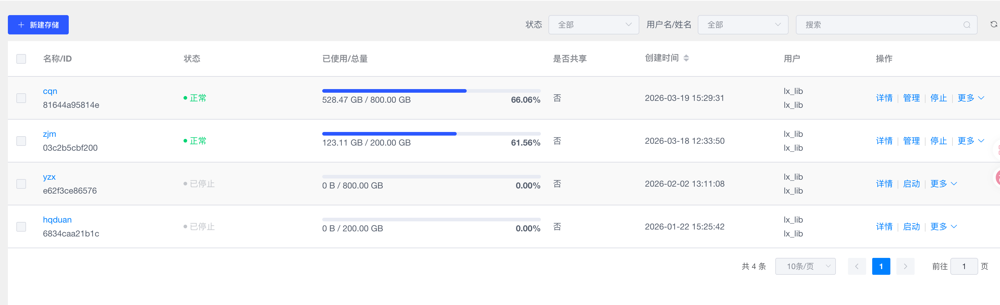
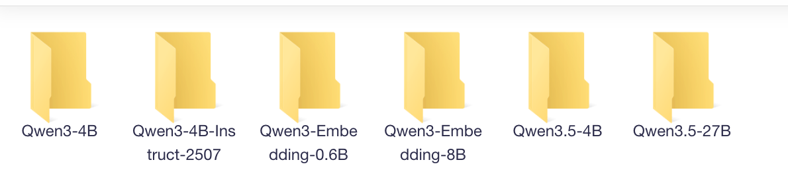
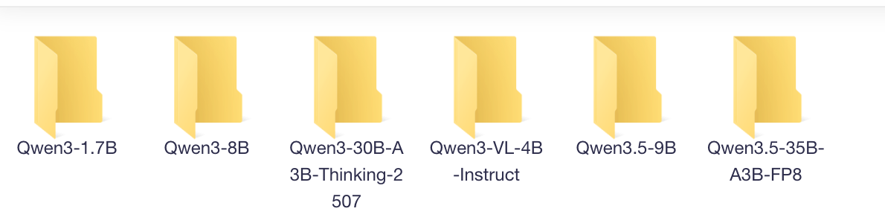

# 实验室云平台使用计划说明
为提升实验室计算资源利用效率、降低整体使用成本，现对云平台资源进行统一规划与管理，具体方案如下：
## 一、计算资源配置

实验室租用的 **GPU 计算卡**，供全体成员共享使用。所有成员通过共享密钥对 **（lx_lab）** 登录与使用相关计算资源。

密钥文件在仓库中 ```private_key_lx_lab.pem``` 密码是123456

### 目前的共享资源：

- shared0
    - ```ssh -i "/your/path/to/private_key_lx_lab.pem" root@172.23.166.144 -p 35687```
- share1

    - ```ssh -i "/your/path/to/private_key_lx_lab.pem" root@172.23.166.144 -p 30852```

### 使用步骤
- 先看已存在的shared卡是否空余，首先使用已经租用的卡
- 文件存储使用新增而不是修改（添加文件存储），这样不影响他人的使用

- 如果shared卡全在使用中，可按需租卡(同样使用共享密钥对)，**用完即还**

    **只要文件存储在，卡回收掉没什么影响，不需要重装环境** 

## 二、存储资源配置

- 实验室统一配置 **2000GB 存储空间**，作为公共数据与模型存储区域，供所有成员共享使用。


### 使用步骤

- 在/ai/xxx（例如xxx/yzx）文件夹下新建文件夹（最好用自己名字命名，避免误删），自己的内容就存在自己的文件夹里（节约空间，不用的内容及时清理）

- 如有下载模型，统一储存在/ai/xxx/Models（例如xxx/zjm/Models）文件夹，并联系仓库管理员更新，需要用哪个模型，提前查看下哪个存储上已经有了,尽量避免重复下载

- miniconda不必重复安装，使用以下命令即可使用

```python
# 其中zjm更换为具体文件夹名字
source /ai/zjm/miniconda3/bin/activate
```

### 目前的文件存储及已有模型：
- cqn /ai/cqn
    - Qwen3-0.6B 
    - Qwen3-Embedding-8B
- zjm /ai/zjm
    - Qwen3-32B
    - bge-m3
- yzx /ai/yzx
    - 

- hqduan /ai/hqduan
    - 
    - 路径为/ai/hqduan/LLM/Qwen

## **三、资源使用原则**

1. **共享优先**：所有计算与存储资源均为公共资源，原则上不做长期独占。
2. **自主协调**：成员之间需根据实际需求进行沟通协调，合理安排任务运行时间。
3. **高效利用**：倡导“见缝插针”式使用资源，避免空闲占用或低效运行。
4. **历史数据管理**：现有存储内容不做统一清理或回溯，由使用者自行管理与优化。

## **四、实施目标**

通过资源共享与统一调度：

- 提高 GPU 使用率，减少资源闲置
- 降低实验室整体运行成本
- 提升多任务并行与科研效率